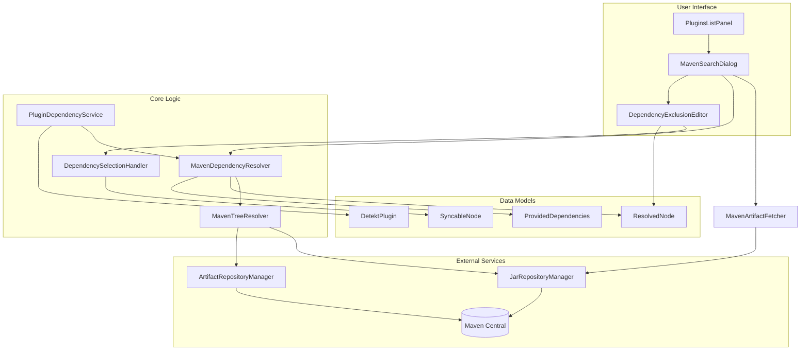
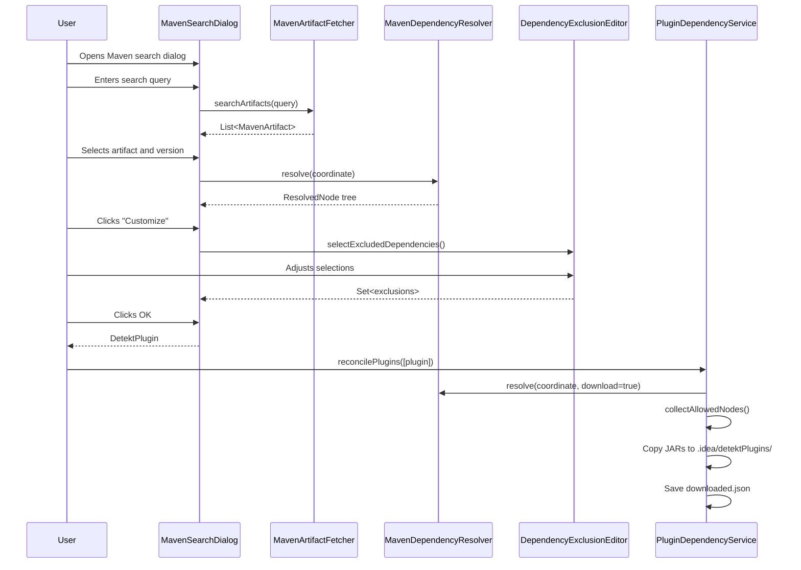

# Detekt Plugin Management

The Detekt IntelliJ Plugin supports extending Detekt's static analysis capabilities by allowing users to
add [third-party rule sets](https://detekt.dev/marketplace) from Maven repositories. Plugins can be added either as
local JAR files or by searching Maven Central directly from the IDE. The system automatically resolves transitive
dependencies, downloads required artifacts, and manages them in a project-local folder (`.idea/detektPlugins/`). Users
can customize which transitive dependencies to include or exclude through an interactive dependency tree editor.

## Architecture Overview



## Component Descriptions

### User Interface Layer

| Component                     | File                                                                                                                    | Purpose                                                                                                         |
|-------------------------------|-------------------------------------------------------------------------------------------------------------------------|-----------------------------------------------------------------------------------------------------------------|
| **PluginsListPanel**          | [PluginsListPanel.kt](src/main/kotlin/io/gitlab/arturbosch/detekt/idea/config/ui/PluginsListPanel.kt)                   | Main configuration panel showing the list of configured plugins. Supports both JAR files and Maven coordinates. |
| **MavenSearchDialog**         | [MavenSearchDialog.kt](src/main/kotlin/io/gitlab/arturbosch/detekt/idea/config/ui/MavenSearchDialog.kt)                 | Dialog for searching Maven artifacts, selecting versions, and previewing transitive dependencies.               |
| **DependencyExclusionEditor** | [DependencyExclusionEditor.kt](src/main/kotlin/io/gitlab/arturbosch/detekt/idea/config/ui/DependencyExclusionEditor.kt) | Tree-based editor for selectively excluding transitive dependencies from download.                              |
| **MavenArtifactFetcher**      | [MavenArtifactFetcher.kt](src/main/kotlin/io/gitlab/arturbosch/detekt/idea/config/ui/MavenArtifactFetcher.kt)           | Handles artifact search and version fetching from Maven repositories.                                           |

### Core Logic Layer

| Component                      | File                                                                                                                         | Purpose                                                                                  |
|--------------------------------|------------------------------------------------------------------------------------------------------------------------------|------------------------------------------------------------------------------------------|
| **PluginDependencyService**    | [PluginDependencyService.kt](src/main/kotlin/io/gitlab/arturbosch/detekt/idea/util/PluginDependencyService.kt)               | Project-level service that orchestrates plugin downloading, reconciliation, and cleanup. |
| **MavenDependencyResolver**    | [MavenDependencyResolver.kt](src/main/kotlin/io/gitlab/arturbosch/detekt/idea/util/MavenDependencyResolver.kt)               | Resolves a Maven coordinate to its full dependency tree.                                 |
| **MavenTreeResolver**          | [MavenTreeResolver.kt](src/main/kotlin/io/gitlab/arturbosch/detekt/idea/util/MavenTreeResolver.kt)                           | Low-level interface to IntelliJ's Maven infrastructure.                                  |
| **DependencySelectionHandler** | [DependencySelectionHandler.kt](src/main/kotlin/io/gitlab/arturbosch/detekt/idea/config/logic/DependencySelectionHandler.kt) | UI-agnostic logic for synchronizing checkbox states across the dependency tree.          |

### Data Models

| Component                | File                                                                                                           | Purpose                                                              |
|--------------------------|----------------------------------------------------------------------------------------------------------------|----------------------------------------------------------------------|
| **DetektPlugin**         | [DetektPlugin.kt](src/main/kotlin/io/gitlab/arturbosch/detekt/idea/util/DetektPlugin.kt)                       | Data class representing a plugin with its coordinate and exclusions. |
| **ResolvedNode**         | [MavenDependencyResolver.kt](src/main/kotlin/io/gitlab/arturbosch/detekt/idea/util/MavenDependencyResolver.kt) | Represents a node in the resolved dependency tree.                   |
| **ProvidedDependencies** | [ProvidedDependencies.kt](src/main/kotlin/io/gitlab/arturbosch/detekt/idea/util/ProvidedDependencies.kt)       | Utility for identifying dependencies provided by the runtime.        |
| **SyncableNode**         | [SyncableNode.kt](src/main/kotlin/io/gitlab/arturbosch/detekt/idea/config/logic/SyncableNode.kt)               | Interface for dependency tree nodes that can be checked/unchecked.   |

## Data Flow

### Adding a Plugin from Maven



#### Step-by-Step Breakdown

1. **Search (`searchArtifacts`)**: The `MavenArtifactFetcher` queries Maven Central and other configured
   repositories using IntelliJ's `JarRepositoryManager`. It returns a list of matching artifacts with all their
   available versions pre-fetched in parallel.

2. **Version Selection**: When the user selects an artifact, the dialog populates a dropdown with available versions
   (sorted latest-first). Selecting a version triggers dependency resolution.

3. **Dependency Resolution (`resolve`)**: The `MavenDependencyResolver` uses IntelliJ's Maven infrastructure to
   fetch the full transitive dependency tree. Each node is marked as:
    - `isProvided`: true if the dependency is provided by the runtime (e.g., kotlin-stdlib)
    - `isRejected`: true if Maven rejected it due to version conflicts

4. **Customize Dialog (`selectExcludedDependencies`)**: Opens the `DependencyExclusionEditor` showing a checkbox
   tree of all dependencies. Users can uncheck dependencies they don't want downloaded. The
   `DependencySelectionHandler` enforces the rules described below.

5. **Plugin Creation**: When the user clicks OK, a `DetektPlugin` object is created containing the Maven coordinate
   and the set of excluded dependency coordinates (_groupId:artifactId_ format).

6. **Reconciliation (`reconcilePlugins`)**: When the settings dialog is closed, the `PluginDependencyService` is
   called with the full list of configured plugins. This triggers the download and cleanup process.

### Plugin Reconciliation and Cleanup

The `PluginDependencyService.reconcilePlugins()` method runs as a background task when plugin settings are saved.
It performs a full synchronization between the configured plugins and the local `.idea/detektPlugins/` folder.

#### When Reconciliation Runs

- **Settings Apply**: When the user clicks "OK" or "Apply" in the Detekt configuration panel
- **Project Open**: When IntelliJ loads the project settings from `detekt.xml`
- **VCS Update**: When `.idea/detekt.xml` is modified by a VCS pull/merge (IntelliJ detects the file change and
  reloads settings via `SimplePersistentStateComponent.loadState()`)

#### What Reconciliation Does

1. **Resolve with Download**: Re-resolves each plugin's dependency tree with `shouldDownload = true`, which tells
   the Maven infrastructure to download JAR files to the local Maven cache (~/.m2/repository).

2. **Collect Allowed Nodes**: Traverses the resolved tree and filters out:
    - Provided dependencies (kotlin-stdlib, detekt-api, etc.)
    - Explicitly excluded dependencies (from user customization)
    - Duplicate coordinates (diamond dependencies)

3. **Copy Missing JARs**: For each allowed dependency, copies the JAR from the Maven cache to
   `.idea/detektPlugins/` using a Maven-style directory structure (`groupId/artifactId/version/artifact.jar`).

4. **Delete Orphaned Files**: Scans the plugin folder and deletes any JAR files that are no longer referenced
   by any configured plugin. This happens when:
    - A plugin is removed from the configuration
    - A plugin's version is changed
    - A transitive dependency is newly excluded

5. **Clean Empty Directories**: After deleting orphaned JARs, removes any empty directories (bottom-up traversal).

6. **Save State**: Writes `downloaded.json` with the current state of all plugins and their transitive dependencies.

7. **Restart Analysis**: Calls `DaemonCodeAnalyzer.restart()` to make IntelliJ pick up the new plugins immediately.

### Dependency Selection Rules

The `DependencySelectionHandler` implements these rules for checkbox synchronization:

1. **Provided Protection**: Nodes marked as "provided" (e.g., kotlin-stdlib, detekt-api) cannot be unchecked
2. **Global Sync**: All occurrences of the same artifact (groupId:artifactId) sync to the same state
3. **Children Propagation**: Unchecking a parent unchecks all non-provided children
4. **Parent Propagation**: Checking a child checks all ancestors

## Version control

The `.idea/detektPlugins/` folder contains downloaded JARs and should **not** be committed to version control. Add it to
your VCS ignore file (e.g., `.gitignore`) so that only plugin configuration in `detekt.xml` is tracked; other
developers and CI will re-download artifacts when they open the project or apply settings.

- **Git**: ensure `.idea/detektPlugins/` is in `.gitignore`
- **Other VCS**: add the equivalent ignore rule for `.idea/detektPlugins/`.

## File Structure

After downloading plugins, the `.idea/detektPlugins/` folder contains:

```
.idea/detektPlugins/
├── downloaded.json                    # Tracking file
├── io/
│   └── nlopez/
│       └── compose/
│           └── rules/
│               └── detekt/
│                   └── 0.4.22/
│                       └── detekt-0.4.22.jar
└── com/
    └── example/
        └── some-rule/
            └── 1.0.0/
                └── some-rule-1.0.0.jar
```

The `downloaded.json` file tracks the state:

```json
{
  "plugins": [
    {
      "coordinate": "io.nlopez.compose.rules:detekt:0.4.22",
      "transitiveDependencies": [
        "com.example:some-rule:1.0.0"
      ],
      "path": "io/nlopez/compose/rules/detekt/0.4.22/detekt-0.4.22.jar"
    }
  ],
  "transitiveFiles": {
    "com.example:some-rule:1.0.0": {
      "path": "com/example/some-rule/1.0.0/some-rule-1.0.0.jar"
    }
  }
}
```

## Provided Dependencies

The following dependency groups are automatically excluded from downloads because they are provided by the
detekt-intellij-plugin runtime:

- `io.gitlab.arturbosch.detekt:*`
- `dev.detekt:*`
- `org.jetbrains.kotlin:*`
- `org.jetbrains.kotlinx:kotlinx-coroutines-*`

These appear as "(provided)" in the dependency tree UI and cannot be unchecked. They are not downloaded as it is assumed
that the detekt IDE plugin already provides these dependencies on the classpath.
