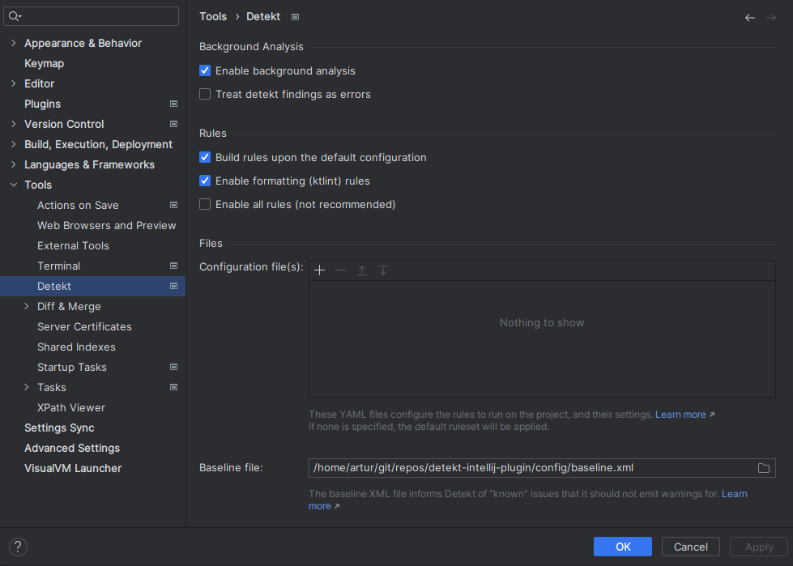

# IntelliJ Detekt Plugin

[](https://kotlinlang.slack.com/messages/C88E12QH4/convo/C0BQ5GZ0S-1511956674.000289/)

[](https://plugins.jetbrains.com/plugin/10761-detekt)
[](https://app.fossa.io/projects/git%2Bgithub.com%2Farturbosch%2Fdetekt-intellij-plugin?ref=badge_large)
[](LICENSE)

Integrates _detekt_, a static code analysis tool for the Kotlin programming language, into IntelliJ.


The plugin can be downloaded from the [Jetbrains plugin repository](https://plugins.jetbrains.com/plugin/10761-detekt).

## Enabling the plugin

- `Settings -> Plugins -> Marketplace -> Search for detekt -> Install`
- Configure the plugin via `Settings -> Tools -> detekt`

## Configuration Options



That's it. Detekt issues will be annotated on-the-fly while coding.

## Autocorrection

You may optionally click `Refactor` -> `AutoCorrect by detekt rules` to auto correct detekt violations if possible.

## Building / developing the plugin

For building the project, the [Gradle IntelliJ plugin](https://github.com/JetBrains/gradle-intellij-plugin)
is used.

```bash
# linux & macOS
./gradlew buildPlugin
# windows
gradlew buildPlugin
```

To test your development, use task `runIde` which will automatically run an Intellij instance to test your new version of detekt plugin.
```bash
# linux & macOS
./gradlew runIde
# windows
gradlew runIde
```

Also install the current `Detekt IntelliJ Plugin` version  to verify you do not introduce new issues.
