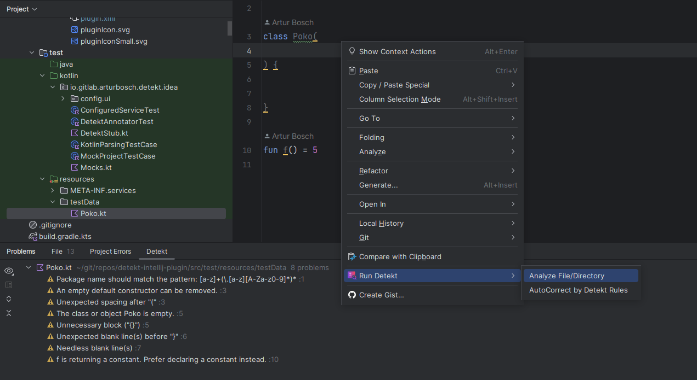

# IntelliJ Detekt Plugin

[](https://kotlinlang.slack.com/messages/C88E12QH4/convo/C0BQ5GZ0S-1511956674.000289/)

[](https://app.fossa.io/projects/git%2Bgithub.com%2Farturbosch%2Fdetekt-intellij-plugin?ref=badge_shield)

Integrates _detekt_, a static code analysis tool for the Kotlin programming language, into IntelliJ.

The plugin can be downloaded from the [Jetbrains plugin repository](https://plugins.jetbrains.com/plugin/10761-detekt).

## Enabling the plugin

- Install the plugin
- Navigate to Settings/Preferences -> Tools -> Detekt
- Check `Enable Detekt` 

## Customization
- Configuration file: Path to custom detekt.yml config file (optional)
- Baseline file: Path to custom baseline.xml file (optional)
- Plugin jars: Path to jar file that has the 'custom rules', if you want them to be reported as well (optional)



That's it. Detekt issues will be annotated on-the-fly while coding.

## Building / developing the plugin

For building the project, the [Gradle IntelliJ plugin](https://github.com/JetBrains/gradle-intellij-plugin)
is used.

```bash
# linux & macOS
./gradlew buildPlugin
# windows
gradlew buildPlugin
```

To test your development, use task `runIde` which will automatically run an Intellij instance to test your new version of detekt plugin.

## License
[](https://app.fossa.io/projects/git%2Bgithub.com%2Farturbosch%2Fdetekt-intellij-plugin?ref=badge_large)
