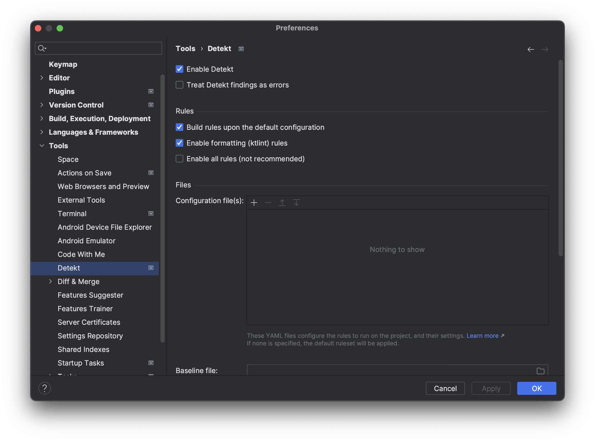

# IntelliJ Detekt Plugin

[](https://kotlinlang.slack.com/messages/C88E12QH4/convo/C0BQ5GZ0S-1511956674.000289/)

[](https://plugins.jetbrains.com/plugin/10761-detekt)
[](https://app.fossa.io/projects/git%2Bgithub.com%2Farturbosch%2Fdetekt-intellij-plugin?ref=badge_large)
[](LICENSE)

Integrates _detekt_, a static code analysis tool for the Kotlin programming language, into IntelliJ.



The plugin can be downloaded from the [JetBrains plugin repository](https://plugins.jetbrains.com/plugin/10761-detekt).

## Enabling the plugin

- `Settings -> Plugins -> Marketplace -> Search for detekt -> Install`
- Configure the plugin via `Settings -> Tools -> detekt`

### Help testing beta releases

- `Settings -> Plugins -> Manage Plugin Repositories`
- Add `https://plugins.jetbrains.com/plugins/beta/list` (check for trailing spaces!)
- Help test `.beta.x` releases and report bugs

## Configuration Options


That's it. Detekt issues will be annotated on-the-fly while coding.

## Third-Party Plugins

You can extend Detekt with third-party rule sets directly from the configuration panel. Add plugins as local JAR files
or search Maven Central for published rule sets. The plugin handles dependency resolution and management automatically.
Do not commit the `.idea/detektPlugins/` folder (it is in `.gitignore`); see [DETEKT_PLUGINS.md](DETEKT_PLUGINS.md) for
details.

For technical details about the plugin mechanism, see [DETEKT_PLUGINS.md](DETEKT_PLUGINS.md).

## Autocorrection

You may optionally click `Refactor` -> `AutoCorrect by detekt rules` to auto correct detekt violations if possible.

## Building / developing the plugin

For building the project, the [Gradle IntelliJ plugin](https://github.com/JetBrains/gradle-intellij-plugin)
is used.

```bash
# linux & macOS
./gradlew buildPlugin
# windows
gradlew buildPlugin
```

To test your development, use task `runIde` which will automatically run an Intellij instance to test your new version
of the detekt plugin.

```bash
# linux & macOS
./gradlew runIde
# windows
gradlew runIde
```

Also install the current `Detekt IntelliJ Plugin` version to verify you do not introduce new issues.
